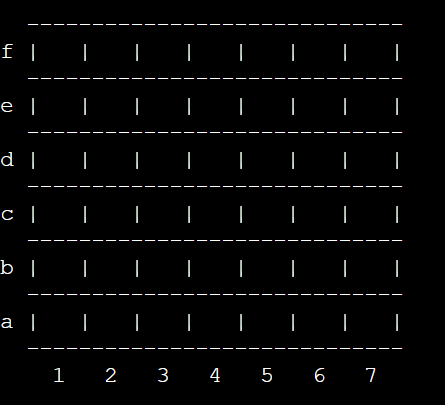
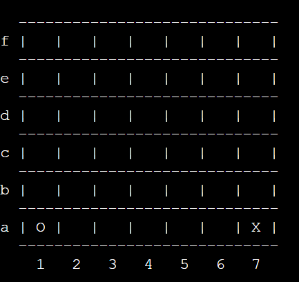
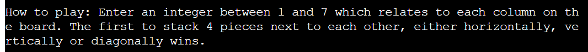

This was a project to create a game that can be ran in the command terminal. It will remind users of the board game they still play or played as kids maybe. 

- Deployed Heroku site here: [Connect Four](https://connect-four-pp3.herokuapp.com/)

## Features

* #### Initial Choice
    * This is prompt the user receives when the program runs.
    * It is simple to understand, make your choice of X or O.
    * Once the user makes their choice the computer is given the remaining option.
    

* #### Game Board
    * This feature is were the game board is generated initially as blank.
    * Once the user makes a move the computer makes a random move.
    * The board will then be generated again with the choices included.
    
    

* #### Game Rules
    * When the player makes their initial choice the rules of te game appear.
    * The rules are straightforward, pick an integer between 1 and 7 and so on.
    

## Technologies

* Python

* [GitHub](https://github.com/)

* [Heroku](https://id.heroku.com/login)

* [GitPod](https://www.gitpod.io/)

## Resources

* [Stack Overflow](https://stackoverflow.com/)

* [W3schools](https://www.w3schools.com/)

* [Slack](https://slack.com/intl/en-ie/)

* [Code Institute](https://codeinstitute.net/)

## Testing
* Manual/User Testing

    * For the testing I sent the link to my partner, three of my friends and my brother. The feedback was that the game worked as expected and they found no errors.

    * I also manually tested the game myself and it worked every time I used it.

* Validator
    * I used [Pep8 Validation](http://pep8online.com/) to validate my python code and it returned no errors. [View report](docs/pep8_validator.png)

## Deployment

The project was deployed to heroku by doing the following:

1. Navigate to [heroku](https://id.heroku.com/login). 

2. Click "new" and create a new App. 

3. Give your app a name (it needs to be unique), choose your region and Click "Create app". 

4. The sections that we are concerned with are "Deploy" and "Settings". Click on "Settings" first. 

5. Build packs now need to be added. These install future dependancies that we need outside of the requirements file. The first is python and the second is node.js. Select Python first and then node.js and click save. Make sure they are in this order.

6. Then go to the deploy section and choose your deployment method. To connect with github select github and confirm. 

7. Search for your repo, select it and click connect. 

8. You can choose to either deploy using automatic deploys which means heroku will rebuild the app everytime you push your changes. For this option choose the branch to deploy and click enable automatic deploys. This can be changed at a later date to manual. Manual deployment deploys the current state of a branch.  

9. Click deploy branch. 

10. If successful you should be able to view your deployed app by clicking "View". 

## Version Control

I used GitHub to keep track of all the updates I made to my code. The steps I followed are below:

- I created a new public repository on GitHub using the Code Institute template.
- I then created a workspace using GitPod and started coding my game.
- To save my work safely I continued to use the terminal consistently by using: 
    - **git add .**  - to add work to git.
    - **git commit -m ""**  - to commit the work.
    - **git push**  - to push the work to GitHub.
    

## Credits

I'd like to thank Nishant Kumar and Kasia Bogucka for their help keeping me on the right track and guiding me.